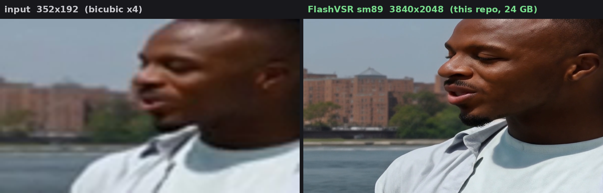
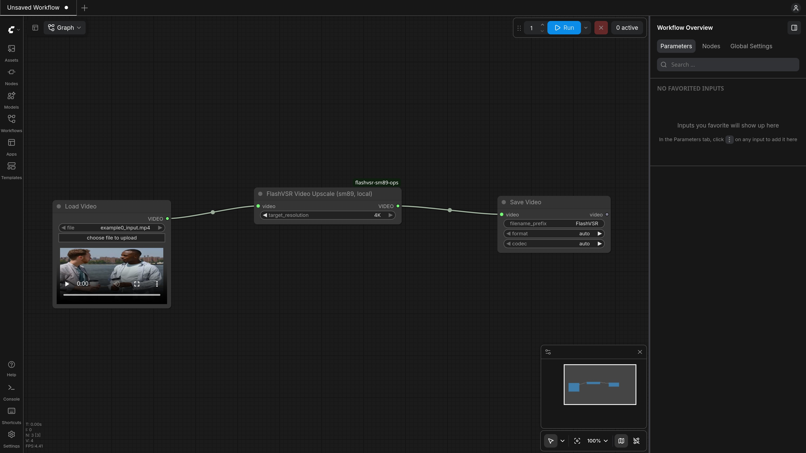
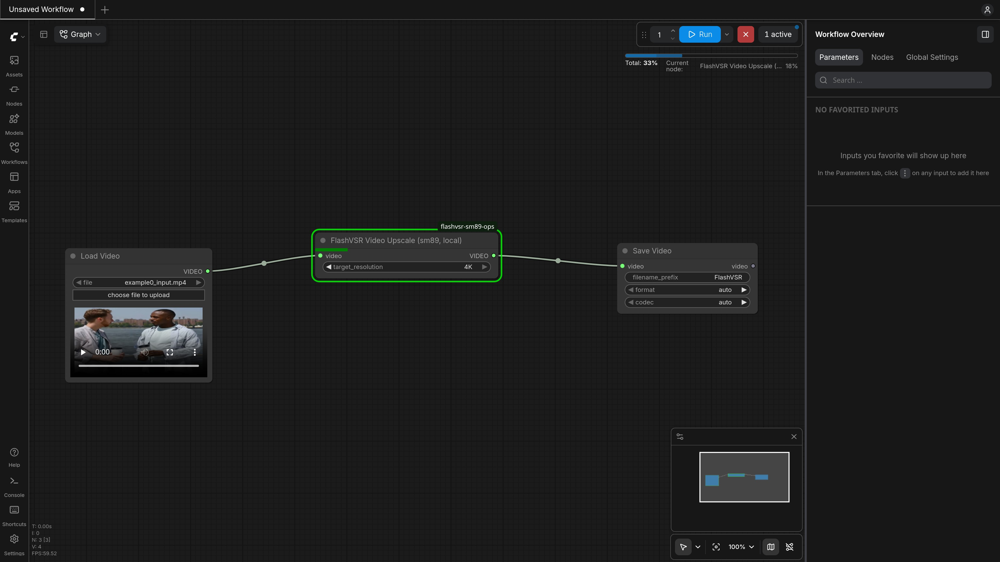
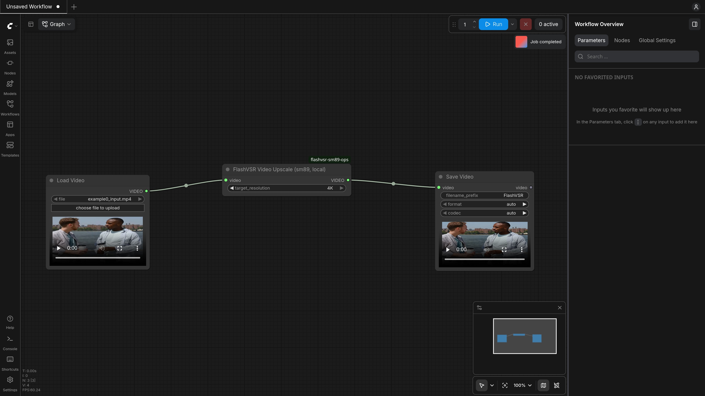

# flashvsr-sm89-ops

[](LICENSE)
[]()
[]()
[]()
[-green)]()
[](https://arxiv.org/abs/2510.12747)

**4K video super-resolution on a single 24 GB RTX 4090 — local, free, and ~1.3× faster than the official pipeline.**

[FlashVSR v1.1 (Tiny)](https://github.com/OpenImagingLab/FlashVSR) is a real-time streaming video super-resolution model whose official pipeline targets A100-class GPUs — it renders the whole output canvas in one pass, so VRAM grows with output pixels and 4K simply does not fit a consumer card. This repo fixes both problems, without editing a line of FlashVSR source and without compiling a single CUDA extension:

- **🧩 A ComfyUI node** — VIDEO in, VIDEO out: the local, free counterpart of ComfyUI's built-in (cloud, paid) FlashVSR node. Canvases above ~1080p render automatically as overlapping spatial tiles, so VRAM tracks one tile, not the canvas — **4K peaks at ~20 GB where the untiled render OOMs at 45 GB**.
- **⚡ An operator pack** — `flashvsr_sm89_ops.enable(pipe)` is one call that runs the official pipeline **~1.3× faster** on a 4090 (14.4–15.0 FPS @ 1408×768): FP8 linears, fused RMSNorm+RoPE and AdaLN, fused GELU→FP8 FFN, and a Triton block-sparse attention stand-in that removes the only CUDA build upstream required.

Tiling is a memory technique and the operators are a speed technique — they stack. Every tile runs the same fused kernels, and the A/B proves it: **1.24× on the tiled path** ([`benchmarks/tiled_ops_ab.json`](benchmarks/tiled_ops_ab.json)).



**The headline numbers** (RTX 4090 D, every number traceable to a JSON in [`benchmarks/`](benchmarks/)):

| | measured | data |
|---|---|---|
| **4K · 3840×2048 · 85 frames** on a 24 GB card | **19.96 GiB peak, ~61 s** — untiled: OOM at 44.8 GiB | [`tiled_render.json`](benchmarks/tiled_render.json) |
| **Speed vs official pipeline** @ 1408×768 | **1.30×** end-to-end (11.5 → 15.0 FPS); 1.26–1.28× on a pristine re-run | [`headtohead_*.json`](benchmarks/), [`pr2_harness_*.json`](benchmarks/) |
| **Speedup retained under tiling** (2K A/B) | **1.24×** — and FP8 trims another ~1.3 GiB off the tiled peak | [`tiled_ops_ab.json`](benchmarks/tiled_ops_ab.json) |
| **Quality** | LPIPS 0.011–0.012 vs official outputs (gate ≤ 0.05); tile seams below global noise | [`quality_cmp.json`](benchmarks/quality_cmp.json), [`tiled_render.json`](benchmarks/tiled_render.json) |

## Use it in ComfyUI

This repository *is* a ComfyUI node pack. One node, the same two inputs as the built-in cloud FlashVSR node, running on your own GPU — no upload, no API key, no credits:

```bash
cd ComfyUI/custom_nodes
git clone https://github.com/aireet/flashvsr-sm89-ops.git
```

Restart ComfyUI (or install via ComfyUI-Manager's *Install from Git*). No pip step — the node imports the operator pack from the cloned checkout itself.

```
[Load Video]  ->  [FlashVSR Video Upscale (sm89, local)]  ->  [Save Video]
     core                      the only custom node                  core
```



| input | default | meaning |
|---|---|---|
| `video` | — | the low-resolution clip, from the core *Load Video* node |
| `target_resolution` | `1080p` | `720p` · `1080p` · `2K` · `4K` — roughly how tall the result should be |

A complete graph ships in [`comfyui/workflows/flashvsr_minimal.json`](comfyui/workflows/flashvsr_minimal.json) — drop it on the canvas, put your clip in `ComfyUI/input/`, and hit Run. First run provisions itself (FlashVSR checkout, ~6.5 GB weights, one-time Triton JIT — same compiler requirement as the quickstart below).

**Case: 352×192 in → 4K out, on a 24 GB card.** Hit Run — the canvas renders as 5 overlapping tiles (~61 s on a 4090 D, 19.96 GiB peak), the node streams per-tile progress into the UI on one bar, and the result lands in *Save Video* with its own preview player:

| rendering | done |
|---|---|
|  |  |

What the node does for you, automatically:

- **Tiles anything over ~2.2 MP** (128-px grid, 256-px blend overlap; how and why in [`docs/tiling.md`](docs/tiling.md)). Measured peaks for a ~3 s clip: **720p ≈ 9 GB · 1080p ≈ 19 GB · 2K ≈ 21 GB · 4K ≈ 20 GB** — every bucket inside 24 GB. 1080p and below stay on the exact untiled path.
- **Keeps the speed**: the sm89 operators run inside every tile (measured 1.24× A/B; FP8 also cuts the tiled peak).
- **Shows per-block progress** in the UI while it runs (tiled renders keep counting across tiles on one bar — verified over WebSocket).
- **Plays by ComfyUI's memory rules**: before a run it frees models other nodes left on the GPU; after the run it parks its pipeline in CPU RAM — safe to chain after a video-generation node on the same card.
- **Output snaps to the model's 128-px grid** (16:9 `1080p` → 1920×1024), keeps the frame rate, and carries audio through when the frame count is unchanged. Short clips are padded by holding the last frame (the streaming model consumes blocks of 8; output follows the `8n+1` rule). Split longer videos with the core *Trim Video* node.

`COMFYUI_ROOT=/root/ComfyUI python comfyui/selftest.py <clip.mp4>` drives the node end-to-end outside the server; `python comfyui/test_tiling.py` is the offline tile-math suite.

## Quickstart (Python, no ComfyUI)

Three commands, no source edits. The reference runner mirrors the official example 1:1 (same input prep, same pipeline call, same output naming), auto-downloads weights (~6.5 GB, once, from HuggingFace) and prints per-clip timing:

```bash
git clone https://github.com/OpenImagingLab/FlashVSR
git clone https://github.com/aireet/flashvsr-sm89-ops
pip install ./flashvsr-sm89-ops

python flashvsr-sm89-ops/examples/run_flashvsr.py \
    --flashvsr-root "$(pwd)/FlashVSR" \
    --input "$(pwd)/my_video.mp4" \
    --out-dir "$(pwd)/results"
```

`--input` accepts a video file or a directory of frames (absolute or relative — both resolve against the directory you run from), and can be repeated for batches. Compare against the stock pipeline by adding `--no-ops` (same process, same weights). If weights are already in place at `FlashVSR/examples/WanVSR/FlashVSR-v1.1/`, add `--no-download` to skip the fetch. No clip handy? `flashvsr-sm89-ops/assets/demo/example0_input.mp4` (352×192, the input of the timed workload below) works.

**Or two lines in your own script** — anywhere after `enable_vram_management`, before `init_cross_kv()`:

```python
import flashvsr_sm89_ops
flashvsr_sm89_ops.enable(pipe)     # FP8 linears + fused kernels + channels_last + Triton attention
```

Standalone use of any operator:

```python
import torch
from flashvsr_sm89_ops import fused_ln_modulate, fused_gate_add, quantize_fp8

x = torch.randn(2, 4096, 1536, device="cuda", dtype=torch.bfloat16)
scale = torch.randn(2, 1536, device="cuda", dtype=torch.bfloat16)
shift = torch.randn(2, 1536, device="cuda", dtype=torch.bfloat16)

y = fused_ln_modulate(x, scale, shift)   # LayerNorm(x)*(1+scale)+shift — note the argument order
z = fused_gate_add(x, scale, x)          # x + gate * residual, bitwise-identical to eager
x8, s = quantize_fp8(x)                  # fused absmax + E4M3 cast, (fp8, per-tensor scale)
```

Tiled rendering is also available to direct callers — hand it your bicubic-×4 canvas, it handles the rest:

```python
from flashvsr_sm89_ops import render_tiled

video = render_tiled(pipe, LQ_video, num_frames=F, height=H, width=W, ...)  # any canvas size
```

Integration details and env flags: [`docs/integration.md`](docs/integration.md). The tiling contract: [`docs/tiling.md`](docs/tiling.md). Per-kernel API: [`docs/kernels.md`](docs/kernels.md). Reproducing every number: [`docs/benchmarks.md`](docs/benchmarks.md).

## Results

Same machine, same session, A/B: official FlashVSR pipeline vs all operators enabled. RTX 4090 D, 1408×768 (the paper's 768×1408 workload), 1-step DMD, full videos. Raw data: [`benchmarks/headtohead_orig.json`](benchmarks/headtohead_orig.json) / [`headtohead_opt2.json`](benchmarks/headtohead_opt2.json).

| Clip | Frames | Baseline | Optimized | Δ | FPS (base → opt) | Peak VRAM (base → opt) |
|---|---|---|---|---|---|---|
| example0 | 89 | 7749 ms | **5952 ms** | −23.2% | 11.49 → **14.96** | 13.1 → **11.3** GB |
| example1 | 97 | 8468 ms | **6505 ms** | −23.2% | 11.46 → **14.91** | 13.8 → **12.0** GB |
| example2 | 97 | 8487 ms | **6537 ms** | −23.0% | 11.43 → **14.84** | 13.9 → **12.0** GB |
| example3 | 81 | 7066 ms | **5443 ms** | −23.0% | 11.47 → **14.88** | 13.4 → **11.7** GB |

**1.30× end-to-end, −1.9 GB peak VRAM.** Quality gate vs official outputs: LPIPS 0.0108 / 0.0122 (threshold ≤ 0.05), PSNR 38.3 / 36.0 dB ([`benchmarks/quality_cmp.json`](benchmarks/quality_cmp.json)). At 1920×1024 input (1080p-class) the pack holds −25.8% latency at 18.8 GB peak — comfortably inside a 24 GB card.

An independent re-run of the same methodology in fresh processes against the one-call integration (pristine upstream clone, no dev-venv crutches) reproduced it as **1.26–1.28× same-session** (stock 11.45–11.49 FPS — identical to the published session; Triton attention backend 1.4% behind the CUDA one): [`benchmarks/pr2_harness_*.json`](benchmarks/), methodology in [`docs/benchmarks.md`](docs/benchmarks.md).

## How 4K fits a 24 GB card

Measured VRAM model: **~1.9 GiB fixed + ~8.6 GiB per output megapixel** (85-frame clip). A full 4K canvas asks for 44.8 GiB — that's the OOM. So above ~2.2 MP, `render_tiled` splits the canvas into overlapping strips of at most ~2.1 MP (the official 1080p workload's shape), runs the identical pipeline call once per tile, and blends with linear ramps that sum to exactly 1:

- every tile is an *official-shape* workload — the per-tile `topk_ratio` is rescaled by canvas/tile area so the token budget lands on the same operating point;
- the LQ canvas stays in CPU RAM and one tile's crop is uploaded at a time — no 4-GiB canvas parked on the GPU;
- seams sit inside a 256-px blend zone; measured seam-column error is *below* the frame's global maximum (no seam signature), and per-tile noise differs from an untiled run the way two seeds would;
- cost: ~+12% wall at 2K; the ops A/B shows the 1.24× speedup survives intact.

Full contract, tile-planner rules, and reproduction: [`docs/tiling.md`](docs/tiling.md), evidence in [`benchmarks/tiled_render.json`](benchmarks/tiled_render.json) + [`benchmarks/tiled_render_seam.png`](benchmarks/tiled_render_seam.png).

## Demos — the official examples, original vs optimized


All four official example clips, rendered end-to-end on the same RTX 4090: the stock pipeline vs this pack (all operators on). Inputs are the official example videos pre-scaled to 352×192 (→ 1408×768 output, the timed workload).

Click any card to play the video (GitHub's built-in player).

| Case | Input | Stock pipeline (4090) ▶ | With this pack (4090) ▶ |
|---|---|---|---|
| **example0** · 89F · 7749 → **5952 ms** | <a href="assets/demo/example0_input.mp4"></a> | <a href="https://github.com/aireet/flashvsr-sm89-ops/blob/main/assets/demo/baseline/example0.mp4"></a> | <a href="https://github.com/aireet/flashvsr-sm89-ops/blob/main/assets/demo/optimized/example0.mp4"></a> |
| **example1** · 97F · 8468 → **6505 ms** | <a href="assets/demo/example1_input.mp4"></a> | <a href="https://github.com/aireet/flashvsr-sm89-ops/blob/main/assets/demo/baseline/example1.mp4"></a> | <a href="https://github.com/aireet/flashvsr-sm89-ops/blob/main/assets/demo/optimized/example1.mp4"></a> |
| **example2** · 97F · 8487 → **6537 ms** | <a href="assets/demo/example2_input.mp4"></a> | <a href="https://github.com/aireet/flashvsr-sm89-ops/blob/main/assets/demo/baseline/example2.mp4"></a> | <a href="https://github.com/aireet/flashvsr-sm89-ops/blob/main/assets/demo/optimized/example2.mp4"></a> |
| **example3** · 81F · 7066 → **5443 ms** | <a href="assets/demo/example3_input.mp4"></a> | <a href="https://github.com/aireet/flashvsr-sm89-ops/blob/main/assets/demo/baseline/example3.mp4"></a> | <a href="https://github.com/aireet/flashvsr-sm89-ops/blob/main/assets/demo/optimized/example3.mp4"></a> |

Latency: stock → optimized (medians, −23%): **1.30× end-to-end, 11.5 → 15.0 FPS**. Direct links: [example0](assets/demo/baseline/example0.mp4) · [example1](assets/demo/baseline/example1.mp4) · [example2](assets/demo/baseline/example2.mp4) · [example3](assets/demo/baseline/example3.mp4) (stock), same paths under `assets/demo/optimized/` for the pack.

Visual quality between the two columns is gated: LPIPS ≤ 0.05 and PSNR ~36–38 dB against the stock outputs ([`benchmarks/quality_cmp.json`](benchmarks/quality_cmp.json)). The rendered demo videos themselves: `eval/demo_times_baseline.json` / `demo_times_optimized.json` record the single-render wall times (6991/6482/6519/5422 ms optimized) and peak VRAM (13.3 → 11.2–11.5 GB).

## Requirements

- GPU: RTX 4090 / 4090 D (sm_89). The FP8 path requires sm_89 tensor cores; the bf16 Triton kernels and the LCSA kernel run on anything sm_80+.
- Python ≥ 3.10, PyTorch ≥ 2.6, Triton ≥ 3.2. Newer stacks work too — the pipeline is verified end-to-end on torch 2.14 / triton 3.8 / transformers 5.17.
- A C compiler and your interpreter's dev headers for Triton's first-run JIT (Debian/Ubuntu: `apt install python3-dev`; match the package to your Python version if you use a non-system interpreter).
- A FlashVSR v1.1 checkout to import the pipeline from. **No CUDA compilation of any kind** — the mit-han-lab Block-Sparse-Attention extension is not needed; a Triton stand-in is installed automatically when it's absent. Other import-time landmines in upstream diffsynth (`modelscope`, transformers-v5 renames) are defused by the pack as well.

## What's inside

| Operator | Replaces | Measured (RTX 4090 D) | Data |
|---|---|---|---|
| `fused_rms_rope` | RMSNorm → RoPE (2 kernels + 4 elementwise passes) | **6.6–14× per instance** (848 GB/s), ≈ −450 ms per full video | [`benchmarks/fused_rope_bench.json`](benchmarks/fused_rope_bench.json) |
| `fused_ln_modulate` / `fused_gate_add` | LayerNorm+modulate / gate+add (5 eager kernels each) | **2.0–3.1× per instance**; gate output bitwise-identical; ≈ −60 ms | [`benchmarks/fused_adaln_bench.json`](benchmarks/fused_adaln_bench.json) |
| `FP8Linear` (E4M3, per-tensor) | bf16 `nn.Linear` in DiT FFN/QKV/out-proj | GEMM **2.07×** (M=18k) / **1.35–1.41×** (M=55k), 276–292 TF on tensor cores | [`benchmarks/fp8_gemm_bench.json`](benchmarks/fp8_gemm_bench.json) |
| `FP8FFN` (GELU→FP8 fusion) | FFN mid-section: GELU + separate quantize pass | bitwise-identical codes vs the two-pass chain; **1.12–1.16×** chain, ≈ −235 ms | [`benchmarks/fp8_ffn_bench.json`](benchmarks/fp8_ffn_bench.json) |
| `TCDecoder channels_last` (+ optional MemBlock `torch.compile`) | NCHW decoder convs | **−16.7%** decode, bitwise-identical; compile adds 1.06× (+0.95 GiB) | [`benchmarks/tcdec_bench.json`](benchmarks/tcdec_bench.json) |
| `lcsa/` Triton block-sparse attention | official CUDA BSA kernel (sm_80 compat build) | **parity: 104–116 vs 101–119 TF**, max diff ≤ 1e-3, allclose; end-to-end within ~3% of the CUDA kernel | [`benchmarks/bsa_compare.json`](benchmarks/bsa_compare.json), [`benchmarks/quickstart_smoke.json`](benchmarks/quickstart_smoke.json) |

The LCSA kernel is a validated drop-in *alternative* to the official CUDA kernel (which already runs at ~78% of achievable throughput on this chip), not the source of the speedup.

## Correctness discipline

Every operator passed a three-level gate before integration:

1. **Op-level parity** vs the eager reference — bitwise where reachable (`gate_add`, GELU→FP8 codes, channels_last), else ≤ 1–2 bf16 ulp (fused norms).
2. **Block-level A/B** through a real `DiTBlock` — catches wiring bugs op-level benches cannot.
3. **End-to-end quality gate** — full videos vs official outputs, LPIPS ≤ 0.05 and PSNR reported ([`benchmarks/quality_cmp.json`](benchmarks/quality_cmp.json)).

The tiling layer has its own suite: tile-coverage invariants over canvas sweeps, blending partition-of-unity, and an identity-render check against a fake pipeline (`comfyui/test_tiling.py`), plus the measured seam/PSNR evidence above.

## FAQ

- **Do I need to build Block-Sparse-Attention?** No. Importing this pack installs a Triton stand-in for the `block_sparse_attn` module when the real package is absent, so the FlashVSR DiT imports cleanly on a stock 4090. If you do have the CUDA extension installed it wins automatically (`FS89_LCSA=auto`, default); `FS89_LCSA=triton|bsa` forces either side. Measured end-to-end delta between the two: ~1.5–3% ([`benchmarks/quickstart_smoke.json`](benchmarks/quickstart_smoke.json)).
- **Does tiling hurt quality or speed?** Speed: ~+12% wall at 2K, and the ops A/B shows the 1.24× speedup retained on the tiled path ([`benchmarks/tiled_ops_ab.json`](benchmarks/tiled_ops_ab.json)). Quality: the 256-px blend zone puts every seam in overlapping context; seam-column error measures *below* the frame's global maximum, and each tile runs at the official workload's operating point ([`docs/tiling.md`](docs/tiling.md)).
- **First run fails with `fatal error: Python.h: No such file or directory`?** Your machine has no Python dev headers, which Triton needs to JIT-compile its kernel on first use (this is a Triton-wide requirement, not specific to this pack). Install the headers matching your interpreter — Debian/Ubuntu system Python: `sudo apt install python3-dev`; a non-system interpreter (e.g. 3.13): `sudo apt install python3.13-dev`. Then rerun; compilation happens once and is cached.
- **Why does the install pull in `ftfy`?** It's needed by the text-encoder path (upstream lists it in its own requirements but it's easy to miss — so this pack declares it). Similarly, diffsynth imports `modelscope` at import time but never calls it when loading the release weights locally; the pack stubs it and raises a clear error only if the downloader path is ever actually used. Details in [`docs/integration.md`](docs/integration.md#compatibility-layers-installed-at-pack-import).
- **Which GPUs?** FP8 paths need sm_89 tensor cores (RTX 4090 / 4090 D, L40, RTX 6000 Ada). The bf16 Triton kernels and LCSA run on anything sm_80+ (A100, 3090, …); on non-Ada cards convert with `parts=()` and keep the fused norms + channels_last.
- **Other resolutions / models?** Numbers here are pinned to the 1408×768 / 1-step workload. The operators are shape-generic (per-tensor scales, no baked shapes); expect the FP8 GEMM gain to shift with the M dimension (see the M=18k vs M=55k rows). Tiling adapts to any canvas — see [`docs/tiling.md`](docs/tiling.md) for the planner rules.
- **Very short clips?** The streaming loop needs `num_frames ≥ 25` (upstream constraint: `(F-1)//8 - 2` iterations). `examples/run_flashvsr.py` and the ComfyUI node hold the last frame until the minimum is reached.
- **Timing scope?** Input prep (CPU bicubic ×4 + padding, ~1.5 s per clip) is reported separately from `pipe()` in the runner output — only the `pipe()` window is the comparable number. See `timing_scope` in [`benchmarks/quickstart_smoke.json`](benchmarks/quickstart_smoke.json). Also: the **first** run on a machine is markedly slower — Triton JIT-compiles its kernels inside the `pipe()` window (measured on the demo clip: 9.5 FPS cold → 13.7 warm). Compilation is cached, so from the second run on you'll see the headline numbers, which are warm medians of the pinned 89-frame workload (methodology in [`docs/benchmarks.md`](docs/benchmarks.md)).
- **Training?** No — inference only; all converted params are frozen.
- **Why isn't LCSA the speedup?** The official CUDA BSA kernel already runs at ~78% of achievable throughput on this chip; the wins are in the elementwise/norm/linear paths.

## Known limits

- Numbers are for the pinned 1408×768 / 1-step pipeline above; other resolutions shift the GEMM M-dimension and the FP8 speedups (see the M=18k vs M=55k rows).
- Tiled rendering trades ~+12% wall time (2K) for bounded VRAM; canvases ≤ 1080p keep the exact untiled path. VRAM still scales with clip length (peaks quoted for a ~3 s / 85-frame clip).
- A custom Triton FP8 GEMM measured 188–205 TF vs cuBLASLt's 204–300 TF — `torch._scaled_mm` stays the backend.
- CUDA Graphs: launch gaps are < 2% of wall for this pipeline; not worth the integration complexity.
- Conv rewrites (Winograd): full-res decoder convs sit at the memory-bandwidth wall; extra FLOPs buy nothing.
- Raw JSON in [`benchmarks/`](benchmarks/).

## Repository layout

| Path | What it is |
|---|---|
| `flashvsr_sm89_ops/` | the operator pack (the pip package): kernels, the one-call `enable()` API, and `render_tiled` |
| `examples/` | direct Python usage — the zero-patch runner and per-operator snippets |
| `comfyui/` | the ComfyUI node pack (`nodes.py`, selftest, offline tiling tests, sample workflow); the root `__init__.py` is ComfyUI's entry point into it |
| `benchmarks/`, `docs/` | the data behind every number above, and the integration/kernel/tiling contracts |

## Acknowledgments & license

Built on [FlashVSR](https://github.com/OpenImagingLab/FlashVSR) (Wan2.1-1.3B, LCSA, TCDecoder), [DiffSynth-Studio](https://github.com/modelscope/DiffSynth-Studio), and [mit-han-lab/Block-Sparse-Attention](https://github.com/mit-han-lab/Block-Sparse-Attention). This pack is new code under **Apache-2.0** (see [LICENSE](LICENSE)); upstream licenses govern the pipeline and model weights you run it with.
